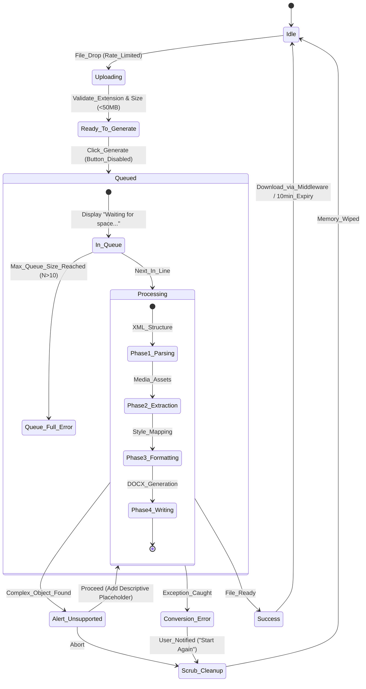

# PRD: Pamphlet (Academic Handout Utility)

## PART I: STRATEGIC VISION (Human-Centric)

### 1. Project Identity

- **Tagline:** Verbatim PowerPoint to Word handout converter.
    
- **GitHub Description:** A privacy-first web utility designed for instructors to transform lecture slides into clean, editable, and paginated Word documents. No data retention, no text alterations—just pure structural reformatting.
    

### 2. Executive Summary

**Pamphlet** is a specialized web utility designed to liberate faculty and instructors from the "formatting tax" of manual document creation. It transforms PowerPoint (.pptx) lecture decks into professional, editable Word (.docx) handouts with 100% verbatim text fidelity. The application prioritizes visual inheritance, ensuring the Word output mirrors the PowerPoint’s original typography, colors, and layout without imposing external accessibility or semantic structures.

### 3. Target Audience & Success Metrics

- **Primary Persona:** Professors, TAs, and Instructors in academic environments.
    
- **Pain Point:** Manual reformatting of slides into handouts is time-consuming; existing tools often alter text or fail to preserve visual branding.
    
- **Success Metrics (KPIs):**
    
    - **Fidelity:** 0% text modification; 100% visual formatting match (Font/Color/Size).
        
    - **Efficiency:** Conversion of a 30-slide deck in < 30 seconds on a standard general-purpose CPU.
        
    - **Privacy Compliance:** 100% deletion of all session data within 10 minutes or immediately upon failure/exit.
        

### 4. User Experience Story (The "Happy Path")

An instructor visits **Pamphlet**, noticing a clear banner stating: _"No data is harvested or stored. Your documents are permanently deleted 10 minutes after conversion."_ They upload a PPTX file (up to 50MB). If the server is at capacity, the **Generate button is disabled** with the message **"Waiting for space to process..."**. Once active, the progress bar moves through four distinct phases: Parsing, Extraction, Formatting, and Writing. The resulting Word document is downloaded via a secure, UUID-based Node.js-managed link.

### 5. Ethical Design, Privacy & Vibe

- **Data Sovereignty:** The tool operates on a "Strict Zero-Persistence" policy. A prominent UI notice informs the user that no data is harvested and all files are purged 10 minutes post-conversion.
    
- **Aesthetics:** Light theme using saturated-pastel accents (Soft Coral, Muted Teal, Rich Buttery Yellow). No special accessibility overlays are required.
    
- **Design Philosophy:** Fidelity over Semantics. The Word document is intended to be a visual clone of the PowerPoint.
    

## PART II: TECHNICAL EXECUTION (Machine-Centric)

### 1. Functional Requirements & Acceptance Criteria

|ID|Feature|Description|Definition of Done (AC)|
|---|---|---|---|
|F01|**Verbatim Parser**|Extract all text from PPTX XML nodes.|1:1 text match; no character alterations.|
|F02|**Direct Visual Mapping**|Inherit PPTX typography & colors directly.|Word text runs use identical RGB/HEX, Font, and Size. **No standard Heading tags.**|
|F03|**Unsupported Guard**|Detect 3D/SmartArt/Complex Objects.|Alert modal states: "Unsupported content detected." Placeholder added with type description: `[Object not supported: SmartArt]`.|
|F04|**Candy Bar Progress**|Phase-based animated progress UI.|4 distinct phases: Parsing → Extraction → Formatting → Writing.|
|F05|**Image/Alt-Text Port**|Move images and existing alt-text to Word.|Images rendered; existing alt-text preserved; NO added text.|
|F06|**Volatile Storage**|Parameterized storage via `.env` with size caps.|Max file size: **50MB**. Files stored in `PAMPHLET_STORAGE_ROOT`subdirs. Purged @ 10m.|
|F07|**Queue Feedback**|Visual queue state management.|Display "Waiting for space to process..." and disable button if queue is at limit.|

### 2. Architectural Diagrams (Mermaid)



### 3. Logic, State & Edge Cases

- **Strict Verbatim Rule:** No text shall be added, modified, or deleted.
    
- **Visual Fidelity Logic:** Do **not** use `Heading` styles. Apply direct run-level formatting to every text node.
    
- **Concurrency & Queueing:**
    
    - **Concurrency:** Limit to **3 concurrent tasks**.
        
    - **Queue Depth:** Max queue size of **10 sessions**.
        
- **Rate Limiting (Cloudflare Aware):**
    
    - **Uploads:** 2 uploads per IP per minute.
        
    - **Downloads:** 1 download per 5s per session ID.
        
    - **Note:** Key rate limiter off `CF-Connecting-IP` header.
        
- **Storage Logic:**
    
    - Root defined via `PAMPHLET_STORAGE_ROOT` (e.g., `/dev/shm/pamphlet`).
        
    - Automatic subdirectories created: `/uploads` and `/downloads`.
        
    - **Download Security:** UUIDv4-based session paths (e.g., `/api/download/:uuid`). Links are unguessable and session-bound.
        
- **System Resilience:**
    
    - **Graceful Shutdown:** On `SIGTERM` or `SIGINT`, execute `SCRUB_ALL` to clear `PAMPHLET_STORAGE_ROOT`before process exit.
        
- **Cleanup Mechanism:**
    
    - **Primary:** `setTimeout` initialized upon session creation to trigger deletion at exactly 10 minutes.
        
    - **Secondary:** Cron job sweep as a fail-safe.
        
- **Unsupported Objects:** Descriptive placeholder: `[Object not supported: {Description}]`.
    

### 4. Data Model & Schema (In-Memory)

- **Session Object:** ```typescript { id: uuid, uploadPath: string, downloadPath: string, expiry: timestamp, status: 'queued' | 'processing' | 'ready' | 'failed' | 'expired', queuePosition: number }
    

```
* **Document Map:**
    * `slides: Array<{ id: number, rawXml: string, elements: Array<{type: 'text'|'img'|'unsupported', props: object, description?: string}> }>`

### 5. Technical Stack & Security
* **Runtime:** Node.js **LTS (>= 22)**.
* **Backend:** Express.js (Lean middleware-based architecture).
* **Frontend:** Static HTML/JS (Vite-built) served by Express.
* **DNS/CDN:** Cloudflare.
* **Core Conversion Libraries:**
    * **PPTX Parsing:** `jszip` (for structure extraction) + direct XML traversal.
    * **Word Generation:** `docx` (NPM package) for high-fidelity style control.
* **Queueing:** `p-queue` (limited to 3 concurrent, 10 pending).
* **Security:** * `helmet.js` for CSP.
    * `express-rate-limit` using `trust proxy` setting for Cloudflare.
    * **Payload Limit:** `multer` and Nginx `client_max_body_size` locked to **50MB**.

### 6. Deployment & VPS Configuration (Ubuntu)
* **Storage Configuration:** `.env` must define `PAMPHLET_STORAGE_ROOT=/dev/shm/pamphlet`.
* **Nginx:** * `client_max_body_size 50M;` (to ensure Nginx doesn't reject valid large uploads).
    * Proxy pass to Express; no direct static mapping for data folders.
* **PM2:** `pm2 start app.js --name "pamphlet"`.
* **Graceful Restart:** `pm2 stop pamphlet` must trigger the Node cleanup logic via `process.on('SIGINT', ...)`.

### 7. Testing Strategy
* **Fidelity Test:** Comparison of PPTX XML nodes vs. DOCX paragraph properties.
* **Queue Stress Test:** Verify rejection at N=11.
* **Shutdown Test:** Kill process and verify `PAMPHLET_STORAGE_ROOT` is scrubbed.
* **Rate Limit Test:** Scripted rapid uploads from a single IP to trigger 429 errors via `CF-Connecting-IP`.

### 8. Development Roadmap
* **Phase 1 (MVP):** Express backend + XML parsing via `jszip` + Parameterized storage.
* **Phase 2 (Hardening):** Concurrency/Queue depth + Cloudflare rate limiting + 50MB caps.
* **Phase 3 (Stability):** Graceful shutdown + `setTimeout` cleanup + PM2/Nginx config.
```